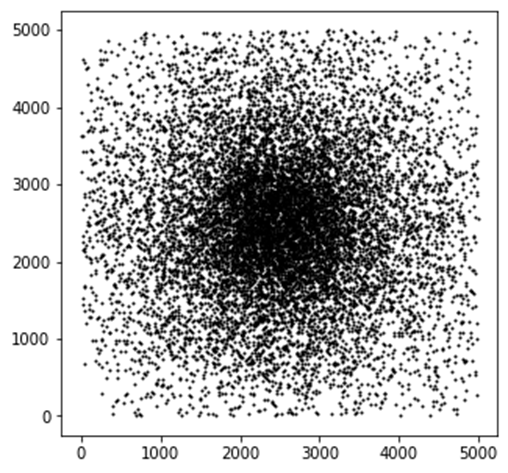

# blu Marketing

Given the fact that transportation costs is an important factor for clients, provide guidlines for clients transportation in blufield.

## Understanding

The small city of blufield has a total number of 8,000 families. Each family lives in a house.
These houses are distributed over a square shaped area of 5000 by 5000 meters by the following distribution: 
    1) ¼ of the houses are distributed normally (mean in center) in a 2000-by-2000 square in the center. With SD=500 meters. 
    2) The remaining ¾ are distributed normally (mean in center) all over the city with SD=1250 meters.

This might be a sample of what blufield may look like:

## Requirments:

Blu, as an online bank, wants to see how much people spend on transportation to a regular bank. Assume the banks are located in the following locations:
A: 2000, 2500
B: 4200, 4000
C: 3500,500
D: 1000,4200
E: 700,500
When going to a bank, people choose the nearest bank available. If it is less than 500 meters away, it would cost 1 unit of money to get there, if it is less than a kilometer away it costs 3 and otherwise it costs 5 units of money to get there. Using this information, answer the following:
1.	In which areas of the city should blu focus on advertising about how using blu would decrease transportation costs more? Provide a heatmap.
2.	Where is the best location to build a new bank to minimize the transportation costs? Providing a heatmap of a measure of “goodness of location” is a plus.
